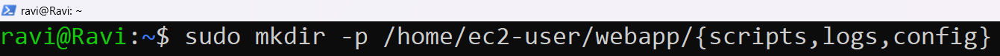
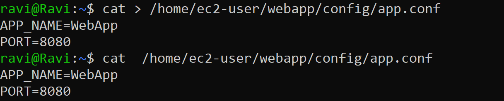
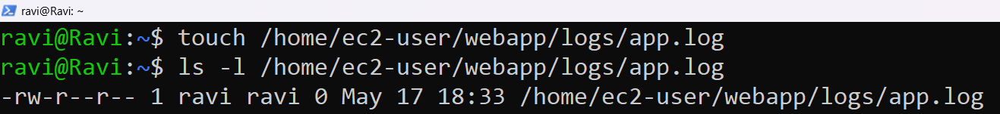
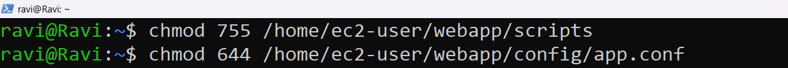
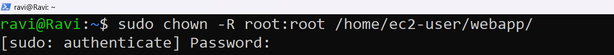
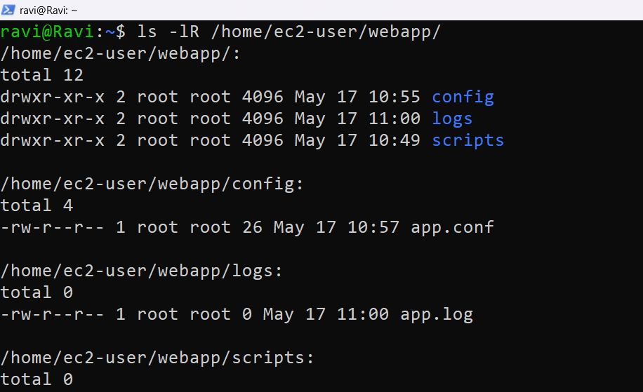

# Testing, Linux and Server Assessment

This project demonstrates Linux file management, permissions, ownership handling, and shell scripting using a Linux environment.

---

# Question 1: File Management and Permissions

## Objective

Create a complete project directory structure from scratch, apply correct permissions, and set ownership using Linux commands.

---

## Project Structure

```text
/home/ec2-user/webapp/
├── scripts/
├── logs/
│   └── app.log
└── config/
    └── app.conf
```

---

### Step 1: Create Directories

#### Command

```bash
sudo mkdir -p /home/ec2-user/webapp/{scripts,logs,config}
```

#### Screenshot



---

### Step 2: Create Configuration File

#### Command

```bash
cat > /home/ec2-user/webapp/config/app.conf
```

#### Content Added

```text
APP_NAME=WebApp
PORT=8080
```

Save the file using:

```text
Ctrl + D
```

#### Screenshot



---

### Step 3: Create Empty Log File

#### Command

```bash
touch /home/ec2-user/webapp/logs/app.log

ls -l /home/ec2-user/webapp/logs/app.log
```

#### Screenshot



The `0` confirms the file is empty (0 bytes).

### Step 4: Set Permissions

#### Commands

```bash
chmod 755 /home/ec2-user/webapp/scripts
chmod 644 /home/ec2-user/webapp/config/app.conf
```

#### Permission Explanation

##### 755

| User | Permission |
|---|---|
| Owner | Read, Write, Execute |
| Group | Read, Execute |
| Others | Read, Execute |

##### 644

| User | Permission |
|---|---|
| Owner | Read, Write |
| Group | Read |
| Others | Read |

#### Screenshot



---

### Step 5: Change Ownership

#### Command

```bash
sudo chown -R root:root /home/ec2-user/webapp/
```

#### Screenshot



---

### Step 6: Verify Final Structure

#### Command

```bash
ls -lR /home/ec2-user/webapp/
```

#### Screenshot



---

## Final Output

```text
/home/ec2-user/webapp:
total 12
drwxr-xr-x 2 root root 22 May 17 config
drwxr-xr-x 2 root root 21 May 17 logs
drwxr-xr-x 2 root root  6 May 17 scripts

/home/ec2-user/webapp/config:
total 4
-rw-r--r-- 1 root root 30 May 17 app.conf

/home/ec2-user/webapp/logs:
total 0
-rw-r--r-- 1 root root 0 May 17 app.log

/home/ec2-user/webapp/scripts:
total 0
```

---

# Question 2: Creating an Interactive Log Script
