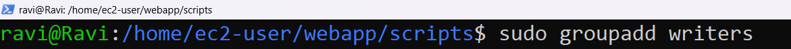
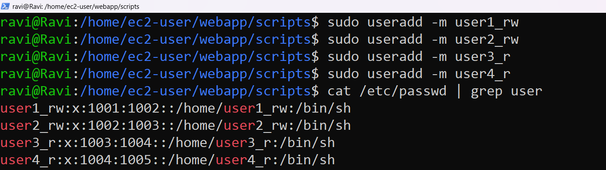
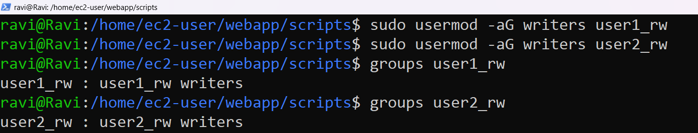
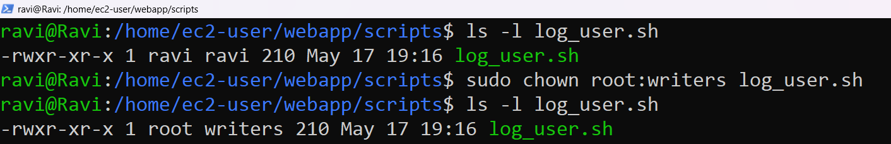
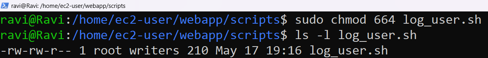
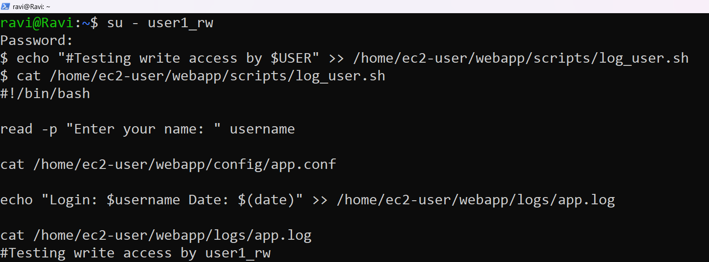
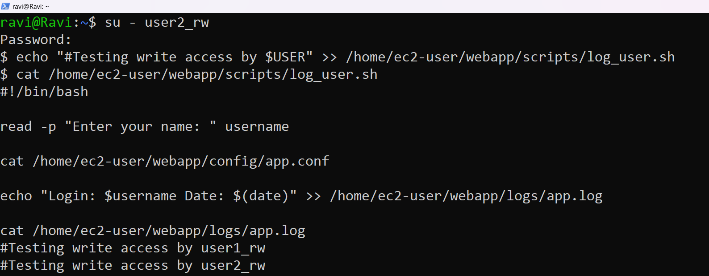
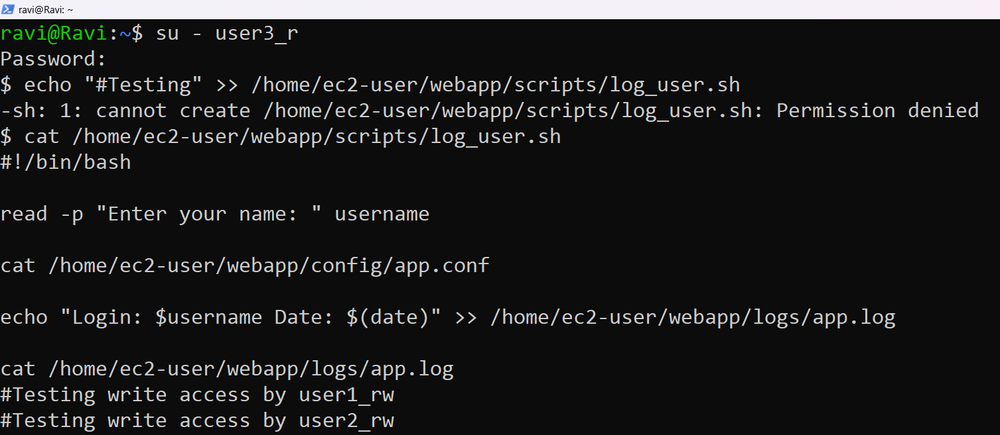
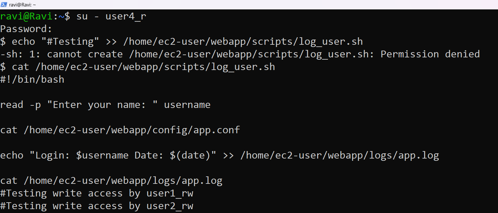

# Testing, Linux and Server Assessment

This project demonstrates Linux file management, permissions, ownership handling, and shell scripting using a Linux environment.

---

# Question 1: File Management and Permissions

## Objective

Create a complete project directory structure from scratch, apply correct permissions, and set ownership using Linux commands.

---

## Project Structure

```text
/home/ec2-user/webapp/
├── scripts/
├── logs/
│   └── app.log
└── config/
    └── app.conf
```

---

### Step 1: Create Directories

#### Command

```bash
sudo mkdir -p /home/ec2-user/webapp/{scripts,logs,config}
```

#### Screenshot


---

### Step 2: Create Configuration File

#### Command

```bash
cat > /home/ec2-user/webapp/config/app.conf
```

#### Content Added

```text
APP_NAME=WebApp
PORT=8080
```

Save the file using:

```text
Ctrl + D
```

#### Screenshot


---

### Step 3: Create Empty Log File

#### Command

```bash
touch /home/ec2-user/webapp/logs/app.log

ls -l /home/ec2-user/webapp/logs/app.log
```

#### Screenshot


The `0` confirms the file is empty (0 bytes).

### Step 4: Set Permissions

#### Commands

```bash
chmod 755 /home/ec2-user/webapp/scripts
chmod 644 /home/ec2-user/webapp/config/app.conf
```

#### Permission Explanation

##### 755

| User | Permission |
|---|---|
| Owner | Read, Write, Execute |
| Group | Read, Execute |
| Others | Read, Execute |

##### 644

| User | Permission |
|---|---|
| Owner | Read, Write |
| Group | Read |
| Others | Read |

#### Screenshot


---

### Step 5: Change Ownership

#### Command

```bash
sudo chown -R root:root /home/ec2-user/webapp/
```

#### Screenshot


---

### Step 6: Verify Final Structure

#### Command

```bash
ls -lR /home/ec2-user/webapp/
```

#### Screenshot


---

## Final Output

```text
/home/ec2-user/webapp:
total 12
drwxr-xr-x 2 root root 22 May 17 config
drwxr-xr-x 2 root root 21 May 17 logs
drwxr-xr-x 2 root root  6 May 17 scripts

/home/ec2-user/webapp/config:
total 4
-rw-r--r-- 1 root root 30 May 17 app.conf

/home/ec2-user/webapp/logs:
total 0
-rw-r--r-- 1 root root 0 May 17 app.log

/home/ec2-user/webapp/scripts:
total 0
```

---

# Question 2: Creating an Interactive Log Script

## Objective

Using the `webapp/` structure from Question 1, create a bash script that:

- Takes user input
- Reads configuration data from `app.conf`
- Writes timestamped log entries
- Displays the log file contents

---

## Script Location

```text
/home/ec2-user/webapp/scripts/log_user.sh
```

---

### Step 1: Navigate to Scripts Directory

#### Command

```bash
cd /home/ec2-user/webapp/scripts/
```

#### Screenshot


---

### Step 2: Create Script File Using Vim

#### Command

```bash
vim log_user.sh
```

#### Screenshot


---

### Step 3: Add Script Content

Press:

```text
i
```

to enter insert mode.

#### Script Content

```bash
#!/bin/bash

read -p "Enter your name: " username

cat /home/ec2-user/webapp/config/app.conf

echo "Login: $username Date: $(date)" >> /home/ec2-user/webapp/logs/app.log

cat /home/ec2-user/webapp/logs/app.log
```

Save and exit using:

```text
Esc -> :wq
```

#### Screenshot


---

### Step 4: Give Execute Permission

Initially, the script did not have execute permission, so running the script resulted in a permission error.

#### Attempt to Run Script

```bash
./log_user.sh
```

#### Output

```text
-bash: ./log_user.sh: Permission denied
```
---

#### Grant Execute Permission

```bash
chmod +x log_user.sh
```

#### Verify Updated Permissions

```bash
ls -l
```

Permissions changed from:

```text
-rw-r--r-- 1 ravi ravi 210 May 17 19:16 log_user.sh
```

to:

```text
-rwxr-xr-x 1 ravi ravi 210 May 17 19:16 log_user.sh
```

This confirms the script is now executable.

#### Screenshot


### Step 5: Run the Script Multiple Times

#### Command

```bash
./log_user.sh
```

The script was executed 3 times using different usernames.

#### Screenshots


---

### Step 6: Verify Log File Entries

#### Command

```bash
cat /home/ec2-user/webapp/logs/app.log
```

#### Screenshot


---

## Final Output

```text
Login: ravi Date: Sun May 17 19:06:38 UTC 2026
Login: teja Date: Sun May 17 19:08:10 UTC 2026
Login: vanum Date: Sun May 17 19:08:34 UTC 2026
```

---

# Question 3: User Groups and File Permissions

## Objective

Create Linux users and groups to control access to the `log_user.sh` script created in Question 2.

The goal is:

- Two users should have write access
- Two users should have read-only access
- Access control should be managed using Linux groups and permissions

---

## Access Requirements

| User | Access Level |
|---|---|
| user1_rw | Read & Write |
| user2_rw | Read & Write |
| user3_r | Read Only |
| user4_r | Read Only |

---

### Step 1: Create Writers Group

#### Command

```bash
sudo groupadd writers
```

#### Screenshot



---

### Step 2: Create Users

#### Commands

```bash
sudo useradd -m user1_rw
sudo useradd -m user2_rw
sudo useradd -m user3_r
sudo useradd -m user4_r
```

#### Verify Users

```bash
cat /etc/passwd | grep user
```

#### Screenshot



---

### Step 3: Add Users to Writers Group

#### Commands

```bash
sudo usermod -aG writers user1_rw
sudo usermod -aG writers user2_rw
```

#### Verify Group Membership

```bash
groups user1_rw
groups user2_rw
```

#### Screenshot



---

### Step 4: Change Group Ownership of Script

#### Command

```bash
sudo chown root:writers log_user.sh
```

#### Verify Ownership

```bash
ls -l log_user.sh
```

#### Screenshot



---

### Step 5: Set File Permissions

#### Command

```bash
sudo chmod 664 log_user.sh
```

#### Verify Permissions

```bash
ls -l log_user.sh
```

Expected output:

```text
-rw-rw-r-- 1 root writers log_user.sh
```

#### Permission Breakdown

| Permission | Meaning |
|---|---|
| Owner (6) | Read & Write |
| Group (6) | Read & Write |
| Others (4) | Read Only |

#### Screenshot



---

### Step 6: Test Write & Read Access for user1_rw and user2_rw

#### Switch to User1

```bash
su - user1_rw
```

#### Test Write Access

```bash
echo "test entry" >> /home/ec2-user/webapp/scripts/log_user.sh
```

#### Screenshot





---

### Step 7: Test Read-Only Access

#### Switch to User

```bash
su - user3_r
```

#### Attempt Write Access

```bash
echo "#Testing" >> /home/ec2-user/webapp/scripts/log_user.sh
```

Expected result:

```text
Permission denied
```


#### Screenshot





---

## Final Verification

#### Command

```bash
ls -l /home/ec2-user/webapp/scripts/log_user.sh
```

#### Final Output

```text
-rw-rw-r-- 1 root writers 210 May 17 19:16 log_user.sh
```

#### Screenshot


